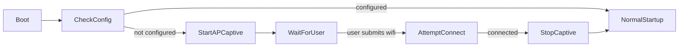

# Captive Portal Implementation Plan (ESP-IDF / ESPHome-style)

Overview
This document captures findings from the repository and defines a step-by-step plan to add a separate captive portal that runs independently from the main HTTPS web service. The captive portal will run when the device has no saved WiFi configuration and will hand off to the normal web service once WiFi is configured.

Key findings from the codebase
- WiFi startup and AP/STA handling lives in [`main/wifi_manager.c`](main/wifi_manager.c:184). It already uses an ESPHome-like APSTA approach and calls [`wifi_start_ap_mode()`](main/wifi_manager.c:229) when no saved config is present.  
- The main web service is an HTTPS server started by [`web_server_start()`](main/web_server.c:358) in [`main/web_server.c`](main/web_server.c:358). It expects certificates and registers many API handlers via [`web_api_register_handlers()`](main/web_api.c:171).  
- The existing setup UI is implemented in [`main/setup.html`](main/setup.html:1) and the initial password flow calls `/api/auth/set-password` which creates a good starting point for captive UI content and WiFi configuration UX.  
- Current startup flow in [`main/main.c`](main/main.c:76) waits for WiFi (polls `wifi_is_connected()`) before starting network services; this must be adapted so captive portal can start immediately when device unconfigured.

Design summary
- Captive portal components:
  - Lightweight HTTP server on port 80 serving captive pages and OS captive-detection endpoints (no TLS) — new module [`main/captive_portal.c`]/[`main/captive_portal.h`].
  - Minimal DNS responder that replies to all DNS queries with the AP IP (192.168.4.1) while captive portal active — new module [`main/dns_responder.c`]/[`main/dns_responder.h`].
  - A small set of API handlers exposed by the captive server (WiFi scan, save config, connect) reusing existing WiFi functions from [`main/wifi_manager.c`](main/wifi_manager.c:259) and API code in [`main/web_api.c`](main/web_api.c:592).
  - Lifecycle hooks in [`main/wifi_manager.c`](main/wifi_manager.c:184) to start/stop captive components: [`captive_portal_start()`](main/captive_portal.c:1), [`captive_portal_stop()`](main/captive_portal.c:1), [`dns_responder_start()`](main/dns_responder.c:1), [`dns_responder_stop()`](main/dns_responder.c:1).

State transition diagram (high level)

Files to add or modify
- Add:
  - [`main/captive_portal.h`](main/captive_portal.c:1) - API to start/stop captive server and register captive API handlers.
  - [`main/captive_portal.c`](main/captive_portal.c:1) - Implementation of lightweight HTTP server (esp_http_server), captive endpoints, static asset serving, and common OS endpoints (/generate_204, /hotspot-detect.html, /ncsi.txt etc).
  - [`main/dns_responder.h`](main/dns_responder.c:1) - API start/stop for UDP DNS responder.
  - [`main/dns_responder.c`](main/dns_responder.c:1) - Simple UDP server listening on 53 returning configured IP for all A queries.
  - A compact captive HTML (binary) — add as binary data (e.g., `main/captive_setup.html`) and include via `target_add_binary_data` in [`main/CMakeLists.txt`](main/CMakeLists.txt:7).
- Modify:
  - [`main/wifi_manager.c`](main/wifi_manager.c:184) — call captive lifecycle functions when no saved config and when connection attempts fail or succeed.
  - [`main/main.c`](main/main.c:76) — start captive components earlier when appropriate; avoid blocking on `wifi_is_connected()` when unconfigured.
  - [`main/web_server.c`](main/web_server.c:358) — ensure web server startup is conditional; allow captive server to run independently (do not start HTTPS when captive active).
  - [`main/web_api.c`](main/web_api.c:592) — factor out or expose the WiFi-related handler registration so captive server can reuse `/api/wifi/scan`, `/api/wifi/connect`, `/api/wifi/config` without exposing full admin APIs.

API surface for captive portal (HTTP only)
- GET /generate_204 -> return 204 or redirect client to /setup.html (to satisfy Android captive detection)
- GET /hotspot-detect.html -> return small page redirecting to /setup.html (iOS detection)
- GET /ncsi.txt and other OS checks -> return content redirecting to /setup.html (Windows)
- GET /setup.html -> captive HTML content (small variant of [`main/setup.html`](main/setup.html:1))
- POST /api/wifi/scan -> start scan and return networks (reuse `post_wifi_scan_handler` logic)
- POST /api/wifi/connect -> accept SSID/password and call [`wifi_connect_sta()`](main/wifi_manager.c:261); may save via [`wifi_save_config()`](main/wifi_manager.c:291)
- GET /api/wifi/config -> return current saved config (like `get_wifi_config_handler`)

Implementation tasks (ordered, detailed)
1. Create captive HTTP module skeleton
   - Add [`main/captive_portal.h`](main/captive_portal.c:1) with functions:
     - bool captive_portal_start(void);
     - void captive_portal_stop(void);
     - void captive_api_register_handlers(httpd_handle_t server); // to allow reuse in main HTTPS server if desired
   - Implement [`main/captive_portal.c`](main/captive_portal.c:1) to start an esp_http_server on port 80 with limited max handlers and register captive endpoints including:
     - `/generate_204`, `/hotspot-detect.html`, `/ncsi.txt`, `/setup.html`, and the three WiFi API endpoints.
   - Keep captive server minimal: static content, JSON APIs for WiFi only.

2. Implement DNS responder
   - Add [`main/dns_responder.c`](main/dns_responder.c:1] that binds UDP socket on port 53 and responds to A queries with configured IP (default 192.168.4.1).
   - Provide start/stop functions: [`dns_responder_start()`](main/dns_responder.c:1) and [`dns_responder_stop()`](main/dns_responder.c:1).
   - Make responder configurable to disable in testing.

3. Extract or wrap WiFi API handlers
   - Create `captive_api_register_handlers(httpd_handle_t)` in [`main/captive_portal.c`](main/captive_portal.c:1) that registers the WiFi-related endpoints by calling or re-using logic from [`main/web_api.c`](main/web_api.c:592). Prefer re-using handler functions (`post_wifi_scan_handler`, `post_wifi_connect_handler`, `get_wifi_config_handler`) but register them on the captive server instance instead of the HTTPS server.
   - Ensure `auth_filter()` is bypassed for captive endpoints; these must allow unauthenticated access.

4. Wire up lifecycle in WiFi manager
   - In [`main/wifi_manager.c`](main/wifi_manager.c:211), when `saved_config.configured` is false, call:
     - `wifi_start_ap_mode()` (existing)
     - `dns_responder_start()`
     - `captive_portal_start()`
   - On successful IP (`IP_EVENT_STA_GOT_IP` handler lines ~100), call `captive_portal_stop()` and `dns_responder_stop()` before continuing with normal startup.
   - On repeated connection failure fallback (existing `wifi_start_ap_mode()` path), ensure captive components are started.

5. Adjust main startup logic
   - Modify [`main/main.c`](main/main.c:76) to detect configuration state:
     - If WiFi configured: proceed with current flow (connect, wait for IP, `ntp_sync_init()`, `cert_ensure_exists()`, `web_server_start()`).
     - If WiFi not configured: do not block waiting for IP; start captive components (AP + captive HTTP + DNS). After captive stops (on connection success) continue with `cert_ensure_exists()` and start `web_server_start()`.
   - Avoid starting HTTPS while captive active to prevent port conflicts and certificate expectations.

6. Add captive HTML asset and CMake integration
   - Create a condensed captive page derived from [`main/setup.html`](main/setup.html:1). Add it as binary data with `target_add_binary_data(${COMPONENT_TARGET} "captive_setup.html" TEXT)` in [`main/CMakeLists.txt`](main/CMakeLists.txt:33).
   - Add new source files to `main/CMakeLists.txt` list.

7. Implement OS captive-detection endpoints and redirect logic
   - `/generate_204` should return 204 (or redirect depending on OS behavior). Some devices only consider a 204 as success and won't open browser; typical approach: return a small HTML redirect page for `/generate_204` to ensure an interactive page opens.
   - Provide both: 204 for plain requests and a small HTML page for browsers by checking `User-Agent` or query parameter if needed.
   - Implement `/hotspot-detect.html`, `/ncsi.txt`, `/success.txt` variations used by different platforms and respond with redirect to `/setup.html`.

8. Testing plan (manual)
   - Boot a fresh device (no saved WiFi); verify AP appears and SSID matches [`wifi_start_ap_mode()`](main/wifi_manager.c:236) default.
   - Connect mobile device to AP and check:
     - iOS: captive detection should pop up the captive page or redirect to `/setup.html`.
     - Android: the OS opens a browser to `/generate_204`; captive portal should redirect to setup.
     - Windows/macOS: accessing common check URLs should return redirect.
   - Use web UI to `POST /api/wifi/connect` and ensure WiFi connects; watch logs in [`main/wifi_manager.c`](main/wifi_manager.c:80-120) for IP event.
   - Verify `dns_responder` returns 192.168.4.1 for arbitrary domain lookups during captive mode.
   - Verify after successful connect: captive server and DNS stopped, HTTPS server started and reachable.

9. Security considerations
   - Captive portal must run HTTP only; explicitly document no passwords transmitted via other endpoints. Use HTTPS only for the normal web server.
   - Limit captive API surface strictly to WiFi-related endpoints and static assets. Do not register admin or certificate endpoints on captive server.
   - Rate-limit `/api/wifi/connect` attempts to prevent misuse; consider backoff on failures.
   - Log actions appropriately in [`main/wifi_manager.c`](main/wifi_manager.c:80) and captive modules for troubleshooting.

10. Developer notes and code pointers
    - Reuse existing WiFi functions: [`wifi_connect_sta()`](main/wifi_manager.c:259), [`wifi_save_config()`](main/wifi_manager.c:291), [`wifi_scan_networks()`](main/wifi_manager.c:453).
    - Reuse existing JSON handlers in [`main/web_api.c`](main/web_api.c:592) where possible to avoid duplication; register same handler functions against captive server handle.
    - Ensure `auth_filter()` usage is avoided for captive WiFi endpoints. The captive server registers WiFi handlers without authentication.
    - Ensure proper memory management for binary assets sent by captive server; use the same `target_add_binary_data` mechanism as existing static assets (`main/CMakeLists.txt`:33-35).

CMake and build updates
- Update [`main/CMakeLists.txt`](main/CMakeLists.txt:7) to add:
  - new source files: `captive_portal.c`, `dns_responder.c`
  - add captive HTML: `target_add_binary_data(${COMPONENT_TARGET} "captive_setup.html" TEXT)`
- Ensure component target URI handler limits are respected for the captive server (HTTP server config for captive mode should use smaller `max_uri_handlers` and smaller memory footprint).

Estimated schedule (rough)
- Design + module scaffolding: 1 day
- DNS responder + captive HTTP server baseline: 1-2 days
- WiFi lifecycle integration + main startup changes: 1 day
- Testing on iOS/Android/Windows/macOS + bugfixes: 1-2 days
- Security review + final polish: 0.5 day

Next steps (what I will do after you approve this plan)
- Create the new files with skeleton implementations and CMake changes. I will implement the captive server and DNS responder in small commits and run the tests listed. I will update the TODO checklist as each step completes.

References to inspect in the repository
- WiFi manager: [`main/wifi_manager.c`](main/wifi_manager.c:1)  
- Web server startup: [`main/web_server.c`](main/web_server.c:358)  
- Web API WiFi handlers: [`main/web_api.c`](main/web_api.c:592)  
- Current setup page (frontend): [`main/setup.html`](main/setup.html:1)  
- Main startup flow: [`main/main.c`](main/main.c:76)  